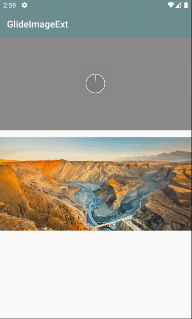

# ImageExt 参考Coil对Glide封装实现

> 主要为ImageView添加扩展函数来简化常见图片加载api [](https://jitpack.io/#forJrking/ImageExt)



## 使用方法

```groovy
allprojects {
	repositories {
		...
		maven { url 'https://www.jitpack.io' }
	}
}
```

```groovy
dependencies {
    implementation 'com.github.forJrking:ImageExt:0.0.3'
}
```
```kotlin
//配置全局占位图 错误图 非必须
ImageOptions.DrawableOptions.setDefault {
    placeHolderResId =  R.drawable.ic_launcher_background
    errorResId = R.color.gray
}
//加载url 单独设置占位图
iv_2.loadImage(url, placeHolder = R.color.blue)
//模糊
iv_3.loadBlurImage(url)
//圆形
iv_4.loadCircleImage(url)
//边框
iv_5.loadBorderImage(url, borderWidth = 10, borderColor = Color.RED)
//黑白
iv_6.loadGrayImage(url)
//圆角
iv_7.loadRoundCornerImage(url, radius = 10, type = ImageOptions.CornerType.ALL)
//resize
iv_8.loadResizeImage(url, width = 400, height = 800)
//支持不需要全局占位图 单独分类管理
val homeOptions = ImageOptions.DrawableOptions(placeHolderResId = R.drawable.home_holder,errorResId = R.drawable.error_holder)
iv_8.load(url){
    drawableOptions = homeOptions
}
//监听回调结果
iv_9.loadImage(url4, requestListener = {
    onSuccess {
        Toast.makeText(application, R.string.load_success, Toast.LENGTH_LONG).show()
    }
    onFail {
        Toast.makeText(application, R.string.load_failed, Toast.LENGTH_SHORT).show()
    }
})
//终极扩展 参数非常多必须使用可选参数方式调用
iv_8.load(url1) {
    placeHolderResId = R.color.black
    transformation = arrayOf(GrayscaleTransformation())
    progressListener { isComplete, percentage, bytesRead, totalBytes ->
        //加载进度
    }
    requestListener {
        onSuccess {
        }
        onFail {
        }
    }
}
//超长扩展函数 选用建议用上面DSL方式
iv_9.loadImage(load = R.drawable.test, with = MainActivity@ this, 
               placeHolderResId = R.color.black,errorResId = R.color.blue,isAnim = false,
        requestListener = object : OnImageListener {
           ...
        },
        onProgressListener = object : OnProgressListener {
         ...
        }, transformation = *arrayOf(GrayscaleTransformation())
)
```

## 可选扩展函数和Api介绍

```kotlin
ImageView.loadImage(...)
ImageView.loadProgressImage(...)
ImageView.loadResizeImage(...)
ImageView.loadGrayImage(...)
ImageView.loadBlurImage(...)
ImageView.loadBlurImage(...)
ImageView.loadRoundCornerImage(...)
ImageView.loadCircleImage(...)
ImageView.loadBorderImage(...)
ImageView.load(load: Any?, options: ImageOptions.() -> Unit)//DSL
```

| `load: Any？`                                                | 加载资源                                                     |
| ------------------------------------------------------------ | ------------------------------------------------------------ |
| `with: Any?`                                                 | Glide.with( )参数，默认用ImageView                           |
| `placeHolderResId: Int`                                      | 占位图 资源id                                                |
| `placeHolderDrawable: Drawable?`                             | 占位图 drawable                                              |
| `errorResId: Int`                                            | 错误图 资源id                                                |
| `errorDrawable: Drawable?`                                   | 错误图 drawable                                              |
| `skipMemoryCache: Boolean = false`                           | 跳过内存缓存                                                 |
| `diskCacheStrategy: ImageOptions.DiskCache`                  | 磁盘缓存策略                                                 |
| `priority: ImageOptions.LoadPriority`                        | 加载优先级                                                   |
| `thumbnail: Float = 0f`                                      | 缩略图 缩略系数                                              |
| ` thumbnailUrl: Any? = null`                                 | 缩略图 url、File等                                           |
| `size: ImageOptions.OverrideSize?`                           | override                                                     |
| `isAnim: Boolean = true`                                     | 动画 gif动图支持                                             |
| `isCrossFade: Boolean = false`                               | crossFade                                                    |
| `isCircle: Boolean = false`                                  | 圆形头像                                                     |
| `isGray: Boolean = false`                                    | 黑白图像                                                     |
| `isFitCenter: Boolean = false`                               | FitCenter                                                    |
| `centerCrop: Boolean = false`                                | centerCrop                                                   |
| `format: Bitmap.Config? = null`                              | 输出图像模式                                                 |
| `borderWidth: Int = 0, borderColor: Int = 0`                 | 边框宽度，边框颜色                                           |
| `isBlur: Boolean = false, blurRadius: Int = 25, blurSampling: Int = 4` | 高斯模糊，模糊半径和图像缩放倍数（倍数越高处理速度越快，图像越不清晰） |
| `isRoundedCorners: Boolean = false, roundRadius: Int = 0, cornerType: ImageOptions.CornerType` | 圆角，圆角弧度，圆角模式，单角、对角、四角                   |
| `vararg transformation: Transformation<Bitmap>`              | 转换器，支持圆角、黑白等和其他自定义                         |
| `onProgressListener: OnProgressListener? = null`             | 网络资源进度监听，仅网络资源有效                             |
| `requestListener: OnImageListener?`                          | 加载结果监听,成功和失败                                      |


## CircleProgressView 仿微博图片加载

就是原封不动来自[GlideImageView](https://github.com/sunfusheng/GlideImageView) ，在布局中加入即可，有三种样式可供选择。
```xml
<CircleProgressView
 	android:id="@+id/progressView"
 	android:layout_width="50dp"
 	android:layout_height="50dp"
 	android:layout_centerInParent="true"
 	android:layout_margin="10dp"
 	android:progress="0"
 	android:visibility="gone"
 	app:cpv_progressNormalColor="@color/transparent10"
 	app:cpv_progressReachColor="@color/transparent90_white"
 	app:cpv_progressStyle="FillInnerArc"
 	app:cpv_progressTextColor="@color/red"
 	app:cpv_progressTextSize="13sp"
 	app:cpv_progressTextVisible="false" />
```
## SelectImageView 仿微信图片点击响应
一个点击可以变为半透明

## CircleImageView 圆形头像

一个圆形图片展示控件

